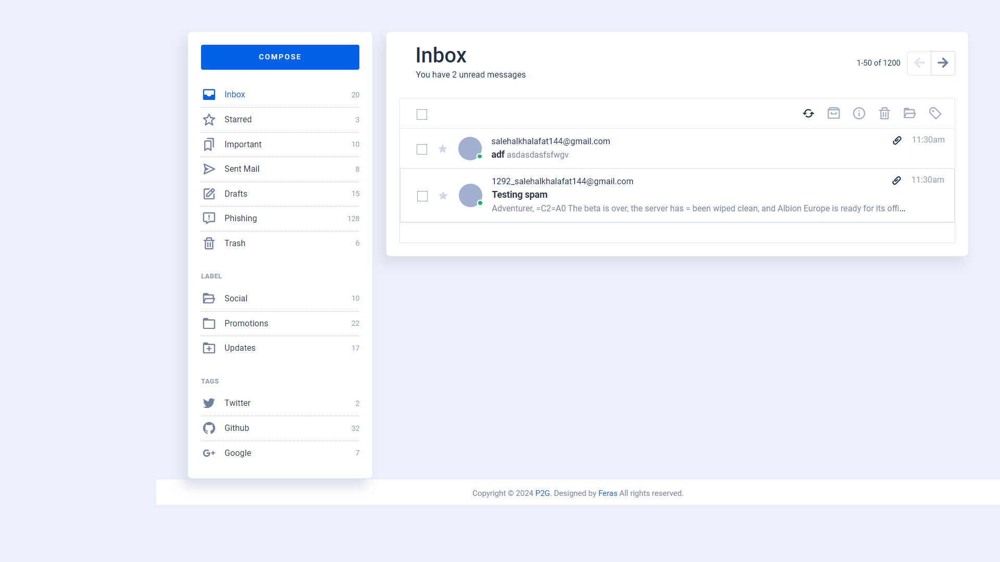
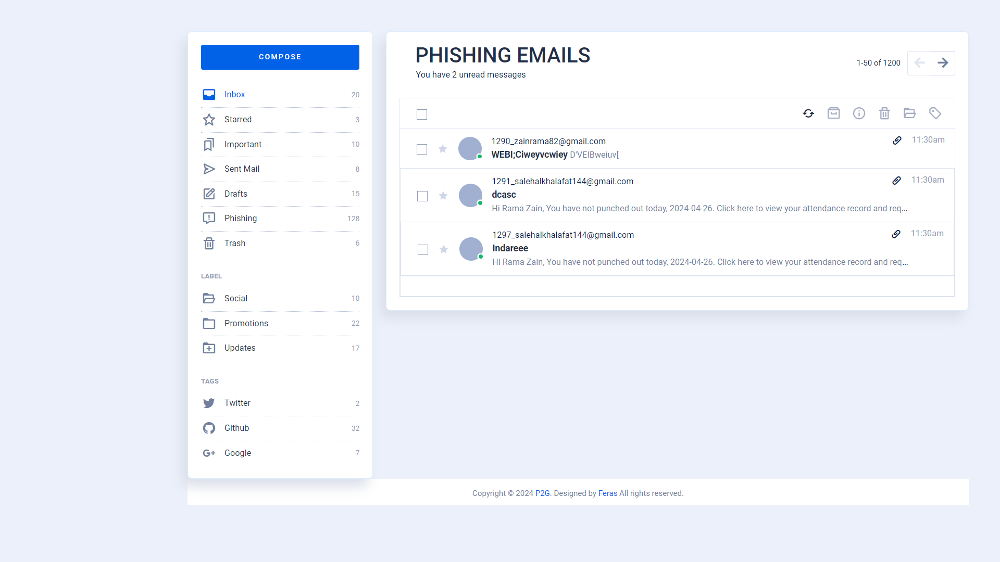

# Gun Phishing

## Project Overview
Gun Phishing is an email security system designed to help protect against phishing threats through automated email analysis. The system leverages a BERT-based AI model, fine-tuned with 21,000 parameters, to detect the likelihood of phishing in incoming emails. Detected emails are then categorized accordingly in the Django backend.

## Features
Automated Email Listening: Uses listen.py to periodically check for new emails.
Phishing Detection AI: Employs a finely-tuned BERT model to analyze email content and determine phishing threats.
Email Categorization: Automatically sorts emails into "General" and "Phishing" categories based on AI assessments.
Django Backend: Manages the data processing and serves the web interface for results visualization.

# Versions
- Python 3.12 or higher
- Django 3.2 or higher

## Installation
- Install Python
- Install django
- All packages in requirements.txt file using `pip install -r requirements.txt` 
- Create virtual environment 
- run `python manage.py makemigrations`
- run `python manage.py migrate`
- run `python manage.py createsuperuser` 
- run `python manage.py runserver`

## Demo

